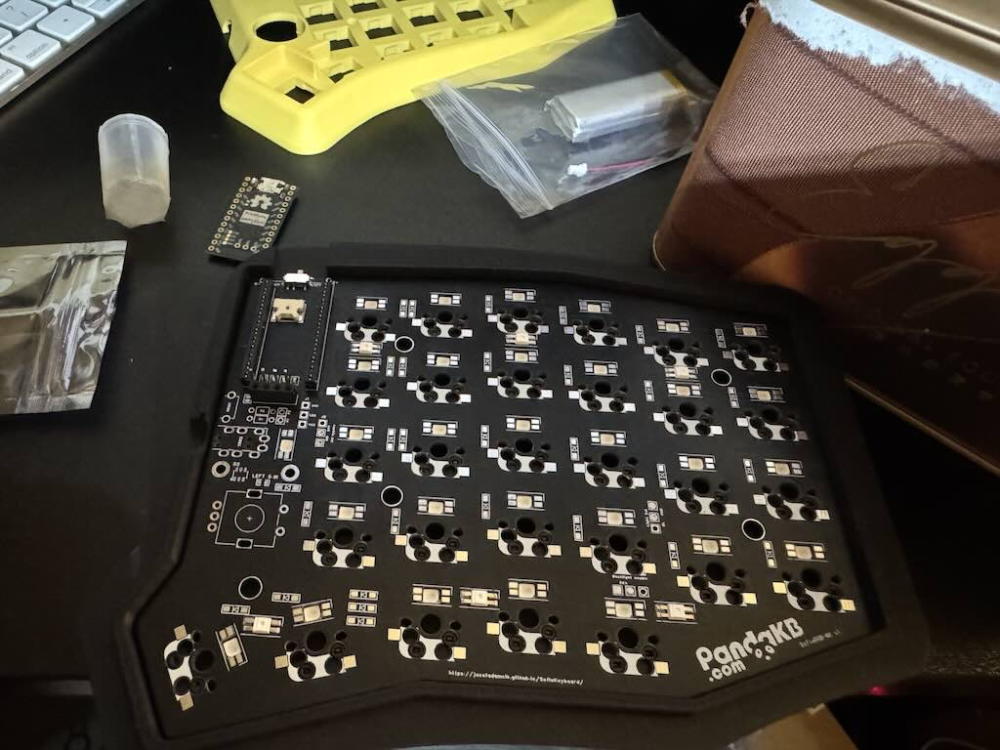
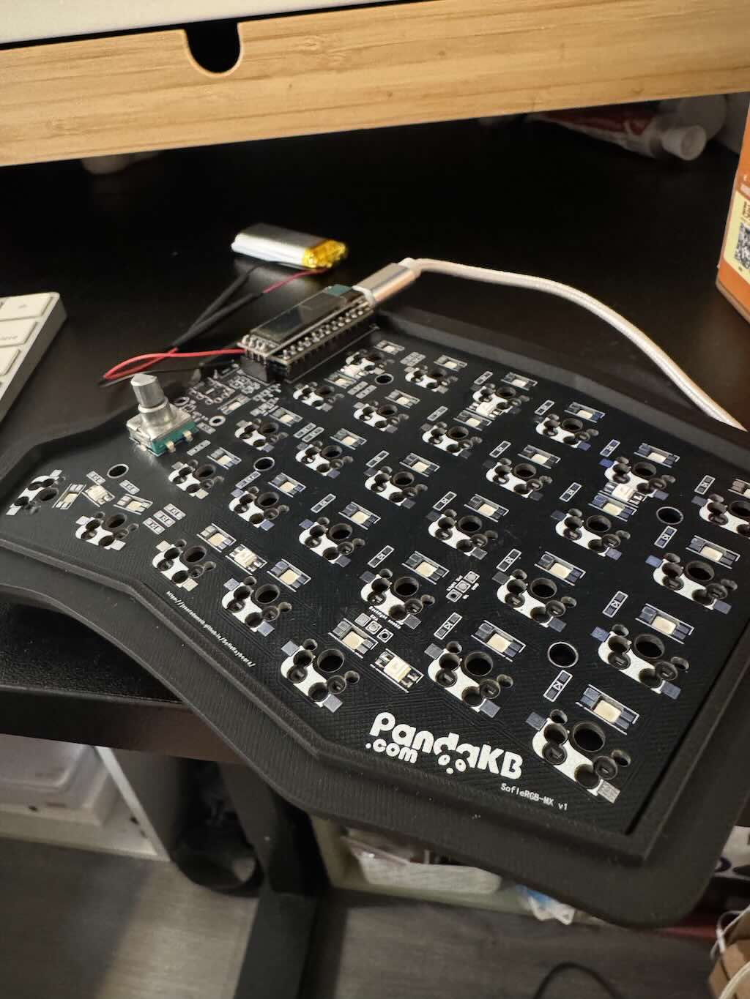
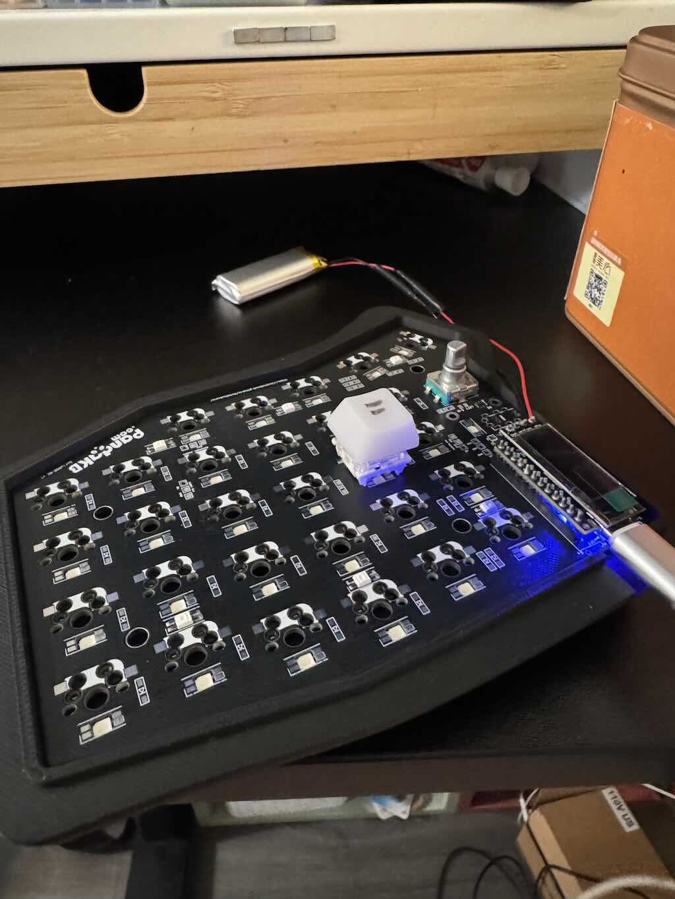
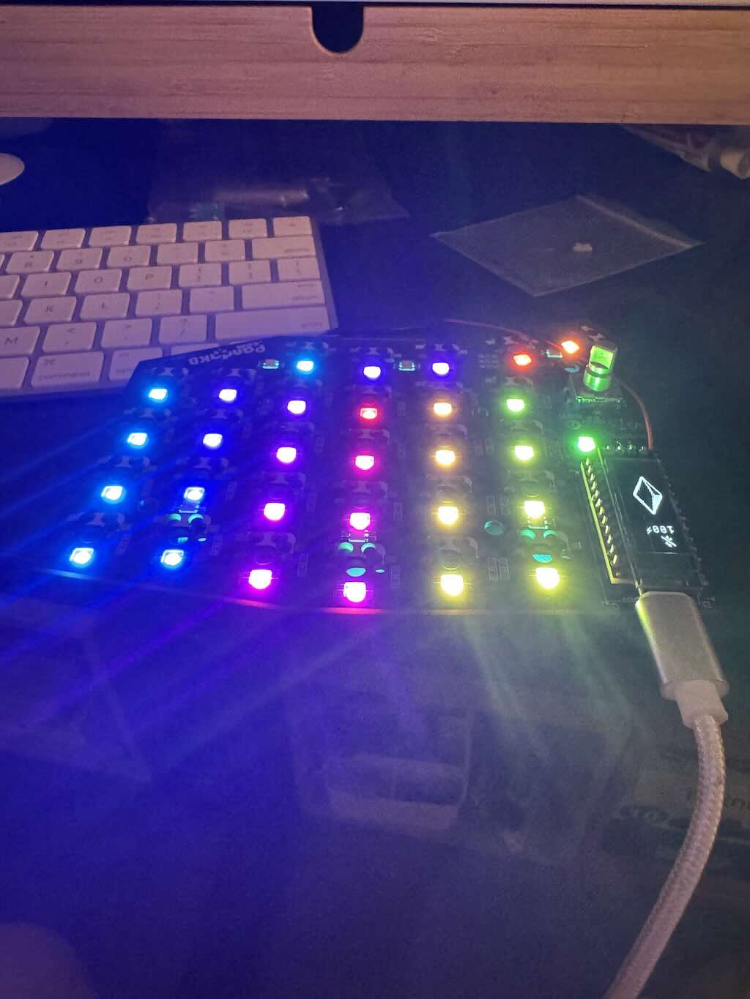
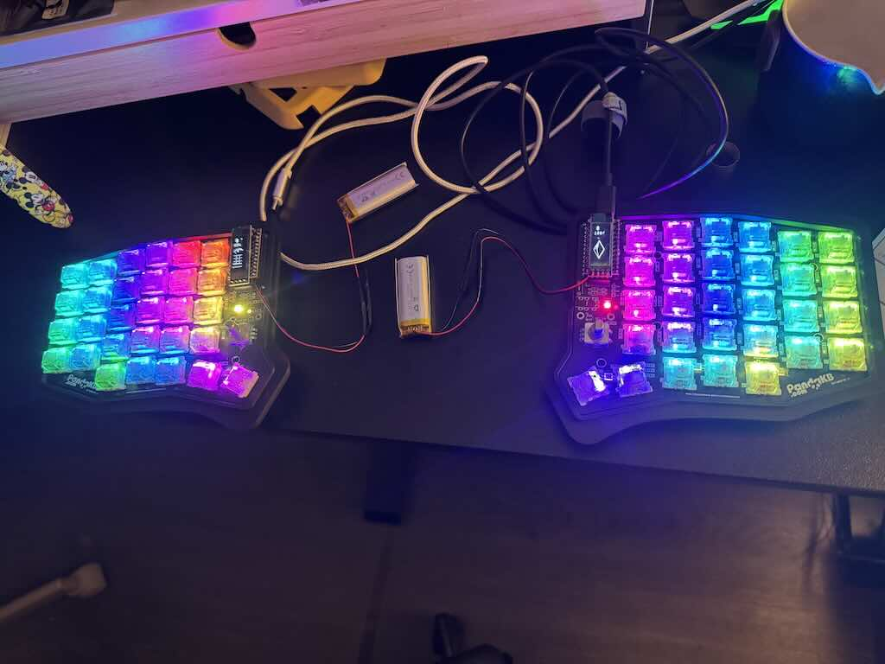
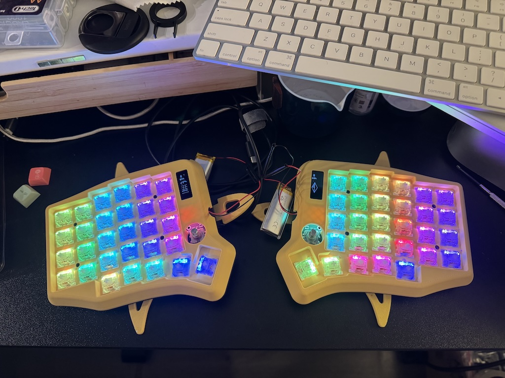
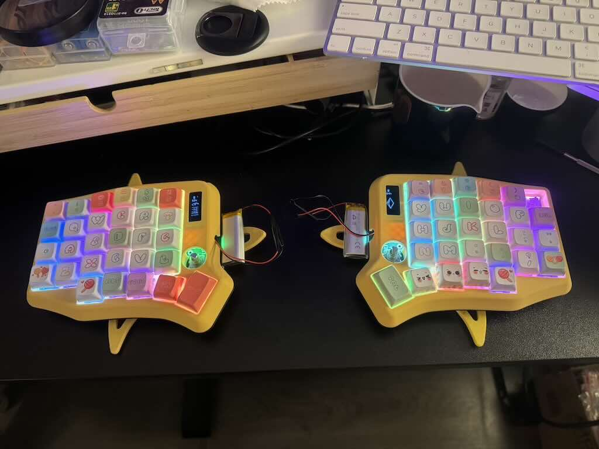

Soldering


# Boards: a small controller board with exposed pads
## NRF52840

# Shilds: a larger keyboard PCB 
## Sofle RGB

## Solder Process
<div>
LCD 
</div>

<div>
Encoder
</div>

<div>
Key
</div>

<div>
LED
</div>

<div>
Battery
</div>

<div>
Keycap
</div>

<div>
Firmware
</div>


Firmware  
## Firmware Requirements
The software will automatically build and release by github action

## Manual build Firmware require below steps

### REF
https://docs.zephyrproject.org/latest/develop/getting_started/index.html

### Prepare(MAC) 
certainly have Win/Linux support, but google by yourself  
Install [Homebrew](https://brew.sh/)
```
brew install cmake ninja gperf python3 python-tk ccache qemu dtc libmagic wget openocd
```

### Create venv
```
python3 -m venv ~/zephyrproject/.venv
source ~/zephyrproject/.venv/bin/activate
pip install west
```

### West init config
```
west init (where project config is for example ~/zephyrproject)
cd ~/zephyrproject
west update
west zephyr-export
```

### Install missing package
```
west packages pip --install pyelftools protobuf grpcio-tools
```

### Which configure wins
   1. `config/boards/shields/sofle/sofle.conf` (Shield Default):
     This file represents the baseline defaults provided by the creator of the shield. It is loaded first.
   2. `config/sofle.conf` (User Override):
     This is your personal user configuration file. The ZMK build system automatically looks for a file named <shield_name>.conf in your config/ directory. It is loaded after the shield defaults.
  What this means for your setup:
  Because Zephyr/ZMK's Kconfig system processes configuration files in order, the **last defined** value for any setting "wins".

### Default branch main(v0.4) vs tag v0.3 build
By default is main branch build for ZMK 0.4  
The v0.3 tag for ZMK 0.3 stable version  
For ZMK 0.4 (the version currently on the main branch):
```
source ~/zephyrproject/.venv/bin/activate
west build -s zmk/app -p always -b nice_nano//zmk -S zmk-usb-logging -- \
-DZMK_CONFIG=$(pwd)/config \
-DSHIELD="sofle_left nice_oled"
west build -s zmk/app -p always -b nice_nano//zmk -- -DZMK_CONFIG=$(pwd)/config -DSHIELD="sofle_right nice_oled"
west build -s zmk/app -b nice_nano//zmk -- -DZMK_CONFIG=$(pwd)/config -DSHIELD="settings_reset"
west build -t pristine
```

* `-S studio-rpc-usb-uart` for zmk studio  
* `-p always` same as pristine build  
* `-S zmk-usb-logging` for debug mode, then connect serial port `sudo tio /dev/tty.usbmodem41301`
