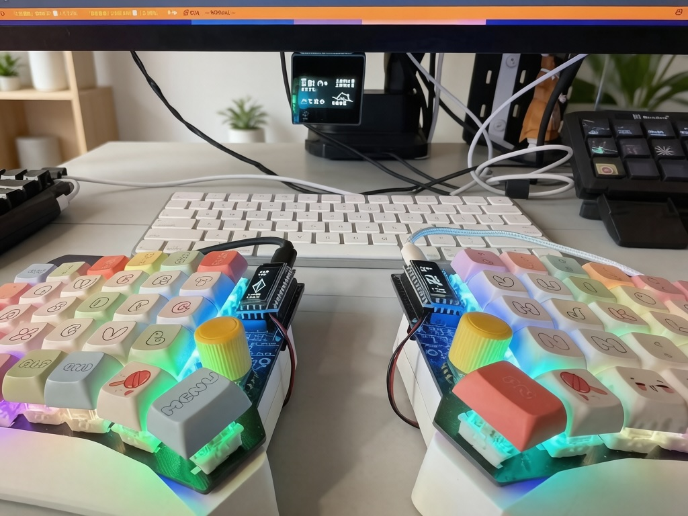
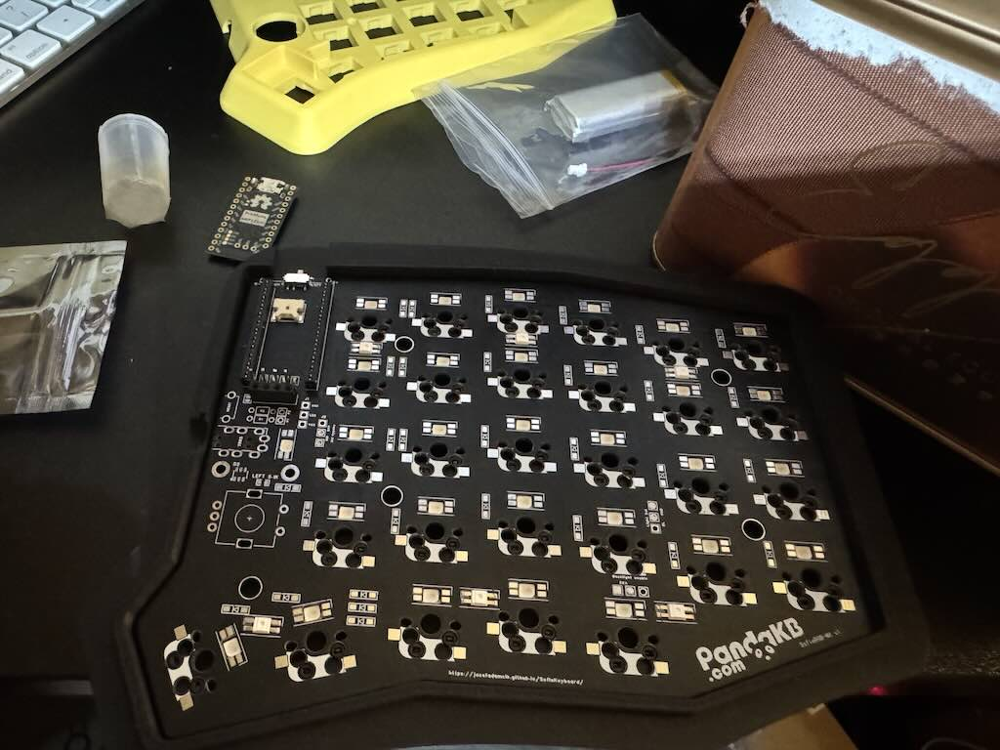
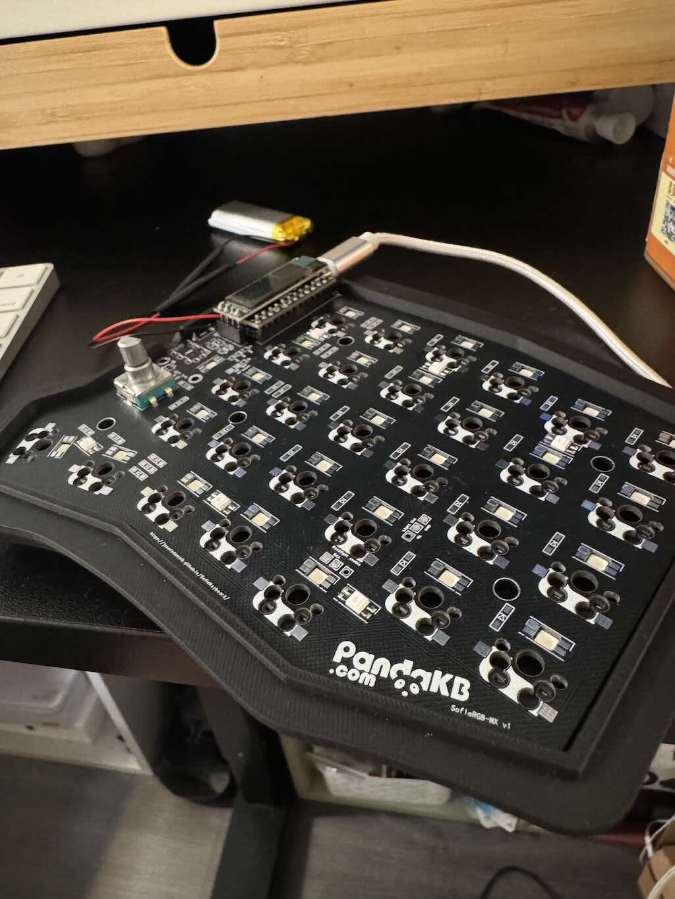
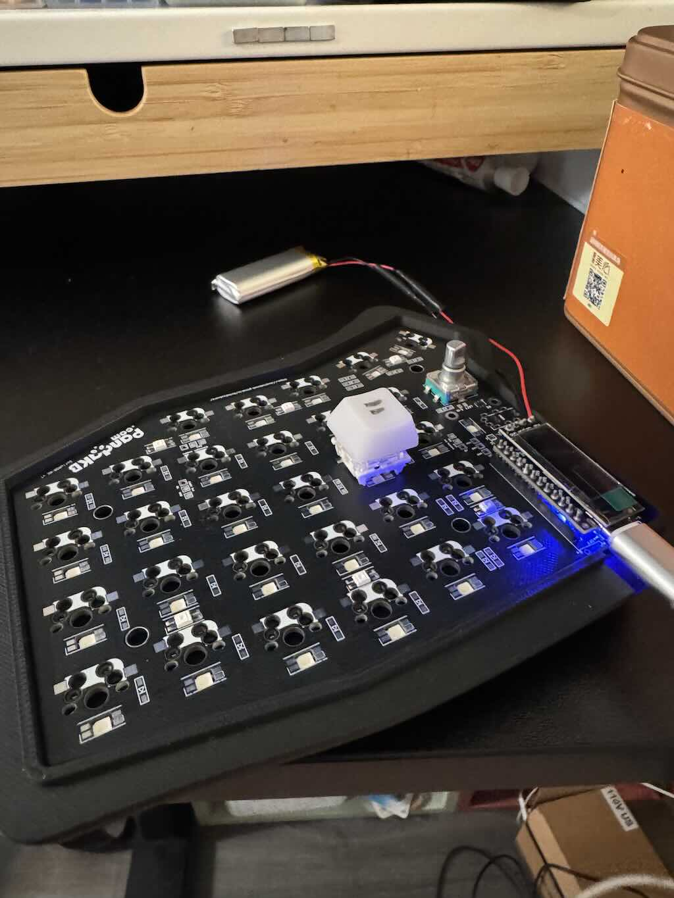
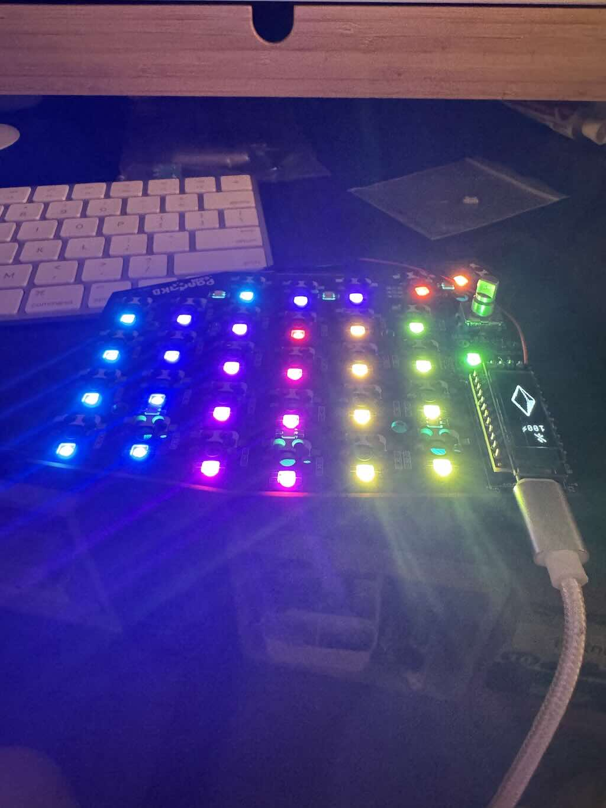
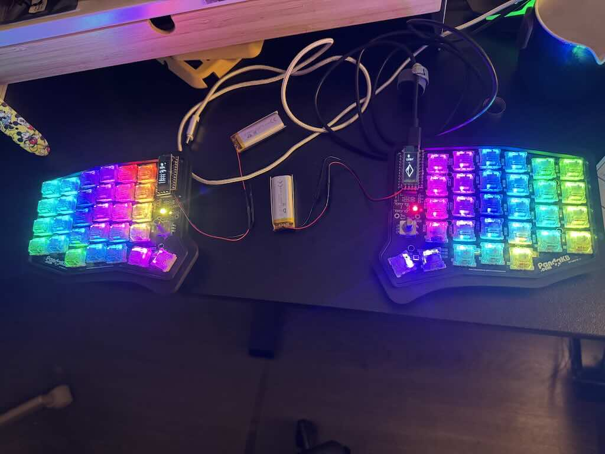
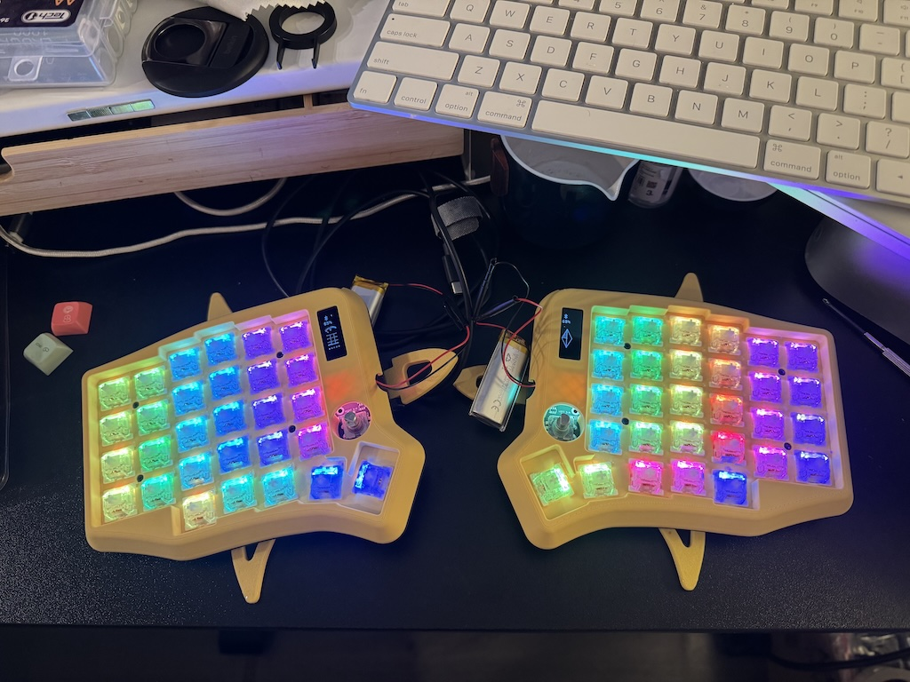
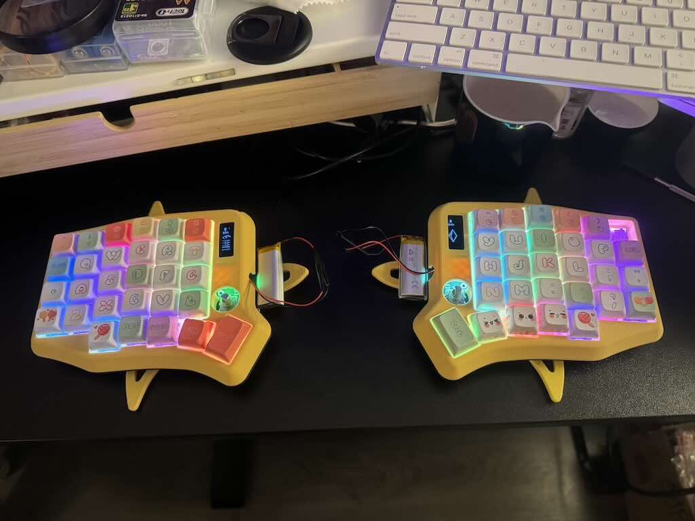

# Sofle RGB — ZMK Config

ZMK firmware configuration for a wireless Sofle RGB split keyboard on nice!nano v2 controllers, with
128x32 OLEDs on both halves driven by [zmk-nice-oled-zz](https://github.com/zzuse/zmk-nice-oled-zz),
and an optional nice!nano v2 dongle with a 1.3" 128x64 SH1106 OLED.

<!-- TODO: add overview photo -->
<p align="center">
  
</p>

## Hardware
| Part | Details |
|---|---|
| Keyboard | Sofle RGB (split, encoders, RGB underglow) |
| Controllers | nice!nano v2 (nRF52840) ×2, plus ×1 for the dongle |
| Half displays | 0.91" 128x32 SSD1306 OLED |
| Dongle display | 1.3" 128x64 SH1106 OLED on I2C (400 kHz), rotated 180° |

## Two Ways to Run

| | Standalone | Dongle |
|---|---|---|
| Central | left half | dongle (USB powered) |
| Left half firmware | `standalone-sofle_left` | `dongle-sofle_left` (peripheral, crystal animation) |
| Right half firmware | `sofle_right` | same |
| Dongle firmware | — | `dongle-sofle_dongle` |
| Keycode / layer / modifiers shown on | left OLED | dongle OLED |
| ZMK Studio | left half | dongle |

Only the central sees keycodes, layers and modifiers, so in dongle mode those widgets move to the dongle and
both halves show the peripheral screen (battery + animation). The dongle also saves battery on the halves.

## Getting Firmware (GitHub Actions)
Every push builds all targets in [`build.yaml`](./build.yaml); pushing a `v*` tag also publishes a release.

| Artifact | Flash to | Setup |
|---|---|---|
| `standalone-sofle_left` | left half | Standalone |
| `dongle-sofle_dongle` | dongle | Dongle |
| `dongle-sofle_left` | left half | Dongle |
| `sofle_right` | right half | both |
| `settings_reset` | any | both |

### Flashing
1. Double-tap reset on the nice!nano; it mounts as a USB drive.
2. Copy the `.uf2` onto it; it reboots on its own.
3. **When switching between standalone and dongle**, flash `settings_reset` to every device first, then the
   new firmware, so the old BLE pairings are cleared. Also remove the keyboard from the host's Bluetooth list.

## Repository Layout
```
build.yaml                           CI build matrix
config/
├── west.yml                         pulls ZMK and zmk-nice-oled-zz
├── sofle.keymap                     keymap (edit this, or use ZMK Studio)
├── sofle.conf                       user settings for the halves
├── sofle_dongle.conf                user settings for the dongle
├── local_macros.dtsi.example        template for private macros (copy to local_macros.dtsi, gitignored)
└── boards/shields/sofle/            Sofle shield copy with the dongle added
    ├── sofle.dtsi, sofle-layouts.dtsi
    ├── sofle_left.overlay, sofle_right.overlay, sofle_dongle.overlay
    └── Kconfig.shield, Kconfig.defconfig, sofle*.conf
```

### Which configuration wins
Kconfig files are applied in order, and the **last** value wins:
1. `config/boards/shields/sofle/sofle.conf` and `sofle_left.conf` / `sofle_right.conf` — shield defaults
2. `config/sofle.conf` or `config/sofle_dongle.conf` — user overrides
3. `cmake-args` in `build.yaml` (or `-D...` on the command line) — per-build overrides, e.g. the dongle-mode
   left half gets `-DCONFIG_ZMK_SPLIT_ROLE_CENTRAL=n -DCONFIG_NICE_OLED_PERIPHERAL_CRYSTAL=y`

### Dongle display tweaks
In `config/boards/shields/sofle/sofle_dongle.overlay`, `&oled`:
- Rotation: `segment-remap` and `com-invdir` are deleted to rotate 180°. Keep both for the original orientation.
- If the image is shifted 2 px sideways, change `segment-offset` between `<2>` and `<0>`.
- Delete `inversion-on` to swap black and white.

## Building Locally (macOS)
Ref: [Zephyr getting started](https://docs.zephyrproject.org/latest/develop/getting_started/index.html)
(Windows and Linux work too).

### 1. Toolchain
```sh
brew install cmake ninja gperf python3 python-tk ccache qemu dtc libmagic wget openocd
python3 -m venv ~/zephyrproject/.venv
source ~/zephyrproject/.venv/bin/activate
pip install west
```
Install the [Zephyr SDK](https://docs.zephyrproject.org/latest/develop/toolchains/zephyr_sdk.html) (arm-zephyr-eabi).

### 2. Workspace
Initialize a west workspace from this repo's manifest:
```sh
west init -l config
west update
west zephyr-export
west packages pip --install        # includes protobuf, needed for ZMK Studio builds
```
If you already have a ZMK workspace elsewhere, keep this repo separate and point builds at it with
`-DZMK_CONFIG=/path/to/zmk-config/config`. The workspace still needs its own `config/west.yml` for west to
resolve modules.

### 3. Build
Activate the venv first (`source ~/zephyrproject/.venv/bin/activate`), then run from the workspace root.
Set `CFG` to this repo's `config` directory (`$(pwd)/config` when the workspace is this repo).

**Standalone**
```sh
west build -d build/left  -s zmk/app -p -b nice_nano//zmk -S studio-rpc-usb-uart -- \
  -DZMK_CONFIG=$CFG -DSHIELD="sofle_left nice_oled"
west build -d build/right -s zmk/app -p -b nice_nano//zmk -- \
  -DZMK_CONFIG=$CFG -DSHIELD="sofle_right nice_oled"
```

**Dongle**
```sh
west build -d build/dongle -s zmk/app -p -b nice_nano//zmk -S studio-rpc-usb-uart -- \
  -DZMK_CONFIG=$CFG -DSHIELD="sofle_dongle dongle_display"
west build -d build/left_peripheral -s zmk/app -p -b nice_nano//zmk -- \
  -DZMK_CONFIG=$CFG -DSHIELD="sofle_left nice_oled" \
  -DCONFIG_ZMK_SPLIT_ROLE_CENTRAL=n -DCONFIG_NICE_OLED_PERIPHERAL_CRYSTAL=y
# right half: same as standalone
```

**Settings reset**
```sh
west build -d build/reset -s zmk/app -p -b nice_nano//zmk -- -DZMK_CONFIG=$CFG -DSHIELD="settings_reset"
```

The firmware is at `build/<name>/zephyr/zmk.uf2`. After the first build, rebuild quickly with `ninja -C build/<name>`.

To develop the display module from a local checkout instead of the one in `west.yml`, add
`-DZMK_EXTRA_MODULES=/path/to/zmk-nice-oled-zz`.

### Build flags
| Flag | Meaning |
|---|---|
| `-p` / `-p always` | Pristine build (same as `west build -t pristine`) |
| `-S studio-rpc-usb-uart` | Enable ZMK Studio over USB (central only) |
| `-S zmk-usb-logging` | Debug logging over USB serial; read with `tio /dev/tty.usbmodem*` |
| `-d build/<name>` | Separate build directory per target |

### Versions
- `main`: ZMK 0.4 (in development) — Zephyr 4.1, LVGL 9
- Tag `v0.3`: ZMK 0.3 stable

## Build Log
<table>
  <tr>
    <td align="center"><br>OLED</td>
    <td align="center"><br>Encoder</td>
    <td align="center"><br>Switches</td>
    <td align="center"><br>LEDs</td>
  </tr>
  <tr>
    <td align="center"><br>Battery</td>
    <td align="center"><br>Keycaps</td>
    <td align="center"><br>Firmware</td>
    <td></td>
  </tr>
</table>
